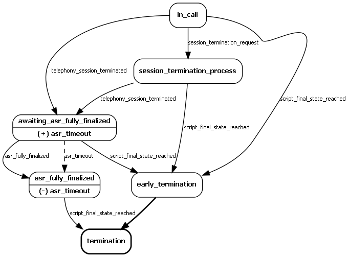

## NiceStateMachineGenerator

Describe state machines declaratively, validate and visualize them, then export to use in your code.


### Background

Sometimes you need to implement a complex behavior in your program.
For example — you may need to to synchronize events from different sources and assure that no 'unexpected' situations happen.

In this situations you may find that you are implementing a state machine.
Some protocols explicitly describe their behavior in terms of state machines (see for example [here](https://datatracker.ietf.org/doc/html/rfc3261#section-17.1.4)).

But with straightforward implementations it's easy to sink in a spaghetti code with all those "_if event E1 comes in state S1 and no event E2 came before, but .._".
And even if you write code with a great caution,how could you be sure that you haven't missed another "_what-if_" situation?

### An Approach

To handle the aforementioned concerns and simplify our lives, we propose the following approach — let's separate the state machine logics and transitions from the rest of the code.
Let's describe the state machine declaratively in a simple DSL, with all the states, events an callbacks needed.
Let's pass this declaration to a formal validation procedure to ensure all the corner cases are handled, and all the transitions are valid.
And then, let's generate a simple code class to wrap all this logic, to use in actual program.

The DSL we propose is language-agnostic enough to support any target language (at least we hope so). For now we have built-in support for C# and C++(20) targets. 
We also support exporting to [Graphviz](https://graphviz.org/) [DOT](https://graphviz.org/doc/info/lang.html) format which allows making nice visualizations like this:
[](https://github.com/mikhail-barg/NiceStateMachineGenerator/tree/main/samples/call_handler)

## The DSL

We assume that the problem domain and the expected behavior may be described in the following terms:
* At any given moment of time the state machine (SM) is in one (an only one) of a predefined number of `states`. State change happens atomically (you may not observe the SM in the process of state change).
* There's a preset number of `events` that may 'happen' at (almost) any moment of time and may cause the SM to change its state. Events represent changes in the world outside the SM on which the SM should react.
* The time is sequential and discrete, and therefore no two events may happen "at the same time". And no other event may happen while the SM is in process of handling a previous event. (This means that SM is single-threaded and threading agnostic. And therefore it means that application code using the SM should povide all the required serialization via appropriate means like locking or [Dispatcher](https://docs.microsoft.com/en-us/dotnet/api/system.windows.threading.dispatcher?view=windowsdesktop-6.0)).

Some more details that are more features than assumptions:
* If needed the SM may operate with `timers`. Timers fire specific `on_timer` event, most of the assumptions about regular events apply to timer events (especially ones about thread-safety).
* The SM provide means to inform the outside world about changes happening in it — those are `callbacks`. There are two types of callbacks:
  * State's `on_enter` callback, that is fired when the SM enters the state.
  * Event's `on_traverse` callback, that is fired when an event (or a timer event) takes place.
* Events may have specific arguments. The SM does not assume anything about those arguments' meaning, it just passes arguments to the corresponding callback.


The DSL to describe state machines is based on JSON. See [samples folder](https://github.com/mikhail-barg/NiceStateMachineGenerator/tree/main/samples/) in this repo for examples.

The State machine file is a plain JSON file consisting of a single root object with the following properties: 
```json
{
  "events": {
    ...
  },
  "timers": {
    ...
  },
  "start_state": "...",
  "states": {
    ...
  }
}
```

In the `"states"` section we describe states of the state machine (no surprise) in the form of `"state_name": { ... }`. Same goes for the `"events"` and `"timers"` section.
State names, as well as event and timer names are exported as identifiers to resulting code without modifications, so keep this in mind when choosing names.

### Events
